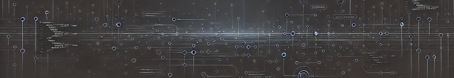

  

<h1 align="center">Hi 👋, I'm Diogo</h1>
<h3 align="center">I've been coding for quite a while and enjoy building stuff with Delphi, Python, SQL, and PHP. I'm also into software architecture and databases. I like keeping things smooth with Docker and Git.

Outside of coding, I’m into rock music and love playing video games — especially metroidvanias, rogue-likes, and flight sims.</h3>

  

<h3 align="left">Connect with me:</h3>

<h3 align="left">Languages and tools</h3>

